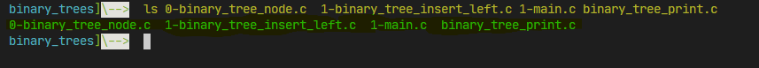
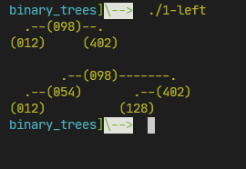

<p align="center">
  
 <h1 align="center">🌲Binary Trees🌲</h1>
 <br>
</p>

--- 
<p align="center">
<BR>
<h1 align="center">Description 💭</h1>
</p>

Holberton School project to learn about the structure of data (binary trees) and solves doubts about what they are, how they are used, how they are created, when to use them.
<pre>
binary_trees]\--> ./1-left
  .--(098)--.
(012)     (402)

       .--(098)-------.
  .--(054)       .--(402)
(012)          (128)

</pre>

<br>
<h1 align="center">Installation 🧩</h1>

 1. Clone the repository
 ```
 git clone https://github.com/seObando19/binary_trees.git
 ```
 2. Run the C compiler as follows with the files
 ```
 gcc -Wall -Werror -pedantic -Wextra binary_tree_print.c [file_main] [file_proccess][...] -o [name_execute]
 ```
 3. Execute the executable file
 ```
 ./1-left
 ```
<br>

<h1 align="center">Example 💯</h1>

```
binary_trees]\--> ls
```
<div align="center"></div>
<br>

```
gcc -Wall -Wextra -Werror -pedantic binary_tree_print.c 1-main.c 1-binary_tree_insert_left.c 0-binary_tree_node.c -o 1-left
```
<div align="center"></div>
<br>


<br>
<h1 align="center">Resources 🛠</h1>

*    [Binary tree](https://en.wikipedia.org/wiki/Binary_tree)
*    [Data Structure and Algorithms - Tree](https://www.tutorialspoint.com/data_structures_algorithms/tree_data_structure.htm)
*    [Tree Traversal](https://www.tutorialspoint.com/data_structures_algorithms/tree_traversal.htm)
*    [Binary Search Tree](https://en.wikipedia.org/wiki/Binary_search_tree)
*    [Data structures: Binary Tree](https://www.youtube.com/watch?v=H5JubkIy_p8)

---
<br>
<p align="center">
    <h2 align="center">Made by Sebastian Obando 👨‍💻</h2>
      <p align="center">
        <a href="https://twitter.com/sebas199141" rel="nofollow">
            
        </a>
	<a href="https://www.linkedin.com/in/sebastian-o-3b2475125/" rel="nofollow">
            
	</a>
	<a href="https://medium.com/@sebastianobandoperez5" rel="nofollow">
            
        </a>
      </p>
</p>

<p align="center">
   
</p>
<p align="center">
	<b>Holberton School - Colombia<b><br>
</p>
<p align="center">
	<b>November, 2020.<b>
</p>
